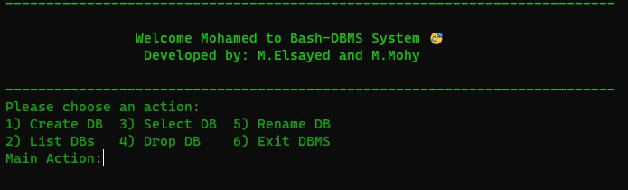

<!-- <p align="center">
    
</p> -->

# **BASH DBMS**

**<h3 style="color:white; font-family:tahoma;">Database</h3>**

<p align="center">
    
</p>
<div text-align="justify"
text-justify = "inter-word">
In computing, a database is an organized collection of data stored and accessed electronically. Small databases can be stored on a file system, while large databases are hosted on computer clusters or cloud storage. The design of databases spans formal techniques and practical considerations including data modeling, efficient data representation and storage, query languages, security and privacy of sensitive data, and distributed computing issues including supporting concurrent access and fault tolerance.
</div>

---

**<h3 style="color:white; font-family:tahoma;">BASH</h3>**

<p align="center">
    
</p>

<div text-align="justify"
text-justify = "inter-word">
Bash is a Unix shell and command language written by Brian Fox for the GNU Project as a free software replacement for the Bourne shell. First released in 1989, it has been used as the default login shell for most Linux distributions.
Bash was one of the first programs Linus Torvalds ported to Linux, alongside GCC.A version is also available for Windows 10 via the Windows Subsystem for Linux.

It is also the default user shell in Solaris 11.
Bash was also the default shell in all versions of Apple macOS prior to the 2019 release of macOS Catalina, which changed the default shell to zsh, although Bash remains available as an alternative shell.

</div>

---

## How To Use ⬇️

Just type in the terminal within the project directory

```bash
./main.sh
```

---

## Features ✔️

- Create/Drop Database
- Listing Existing Database
- Connect Existing Database:
  - Create/Drop table
  - Drop tables
  - Listing all tables
  - Insert operations
  - Select operations
  - Delete operations
  - Update operations
- Rename Existing Database
- Drop Existing Database

---

## ▶️ Demo

<details open="" class="details-reset border rounded-2">
  <summary class="px-3 py-2 border-bottom">
    <svg aria-hidden="true" viewBox="0 0 16 16" version="1.1" data-view-component="true" height="16" width="16" class="octicon octicon-device-camera-video">
    <path fill-rule="evenodd" d="..."></path>
</svg>
    <span aria-label="Video description dotnet-evergreen.mp4" class="m-1">Demo</span>
    <span class="dropdown-caret"></span>
  </summary>

  <video src="https://www.veed.io/view/b20dc053-3621-4c1d-9358-031c911d3768" data-canonical-src="https://www.veed.io/view/b20dc053-3621-4c1d-9358-031c911d3768" controls="controls" muted="muted" class="d-block rounded-bottom-2 width-fit" style="max-height:640px;">

  </video>
</details>

---

## Contributors 

- **[Mohamed Mohy](https://github.com/Mohy-dev)**
- **[Mohamed Said](https://github.com/Stoon2)**

<p align="center">
    
</p>
